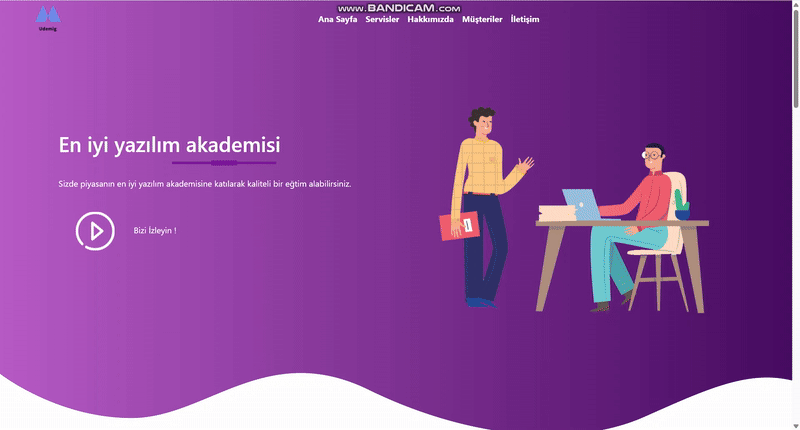

<h1> Udemy Education Project </h1>
Bu proje, HTML, CSS ve Bootstrap kullanılarak geliştirilmiş modern ve kullanıcı dostu bir eğitim platformudur. Responsive tasarımı sayesinde farklı cihazlarda sorunsuz bir deneyim sunmaktadır.

<h2> Kullanılan Teknolojiler </h2>

 -HTML
 
 -CSS
 
 -Bootstrap

 <h2> Özellikler </h2>
 
 -Mobil uyumlu tasarım

 -Kullanıcı dostu arayüz

 -Bootstrap bileşenleri ile zenginleştirilmiş görünüm

 -Kolayca özelleştirilebilir yapı

 <h2> Ekran Görüntüsü </h2>

 
